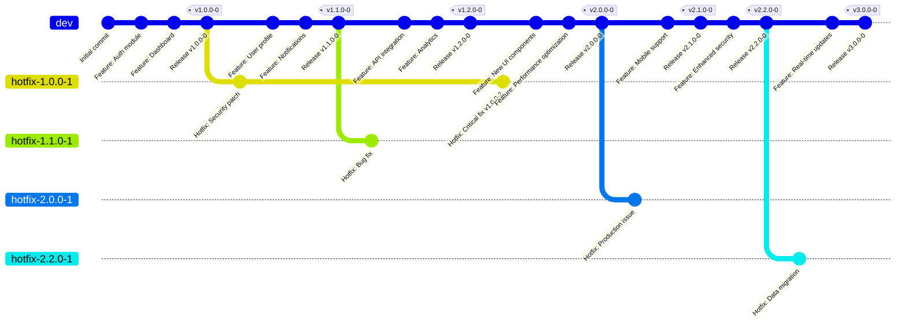
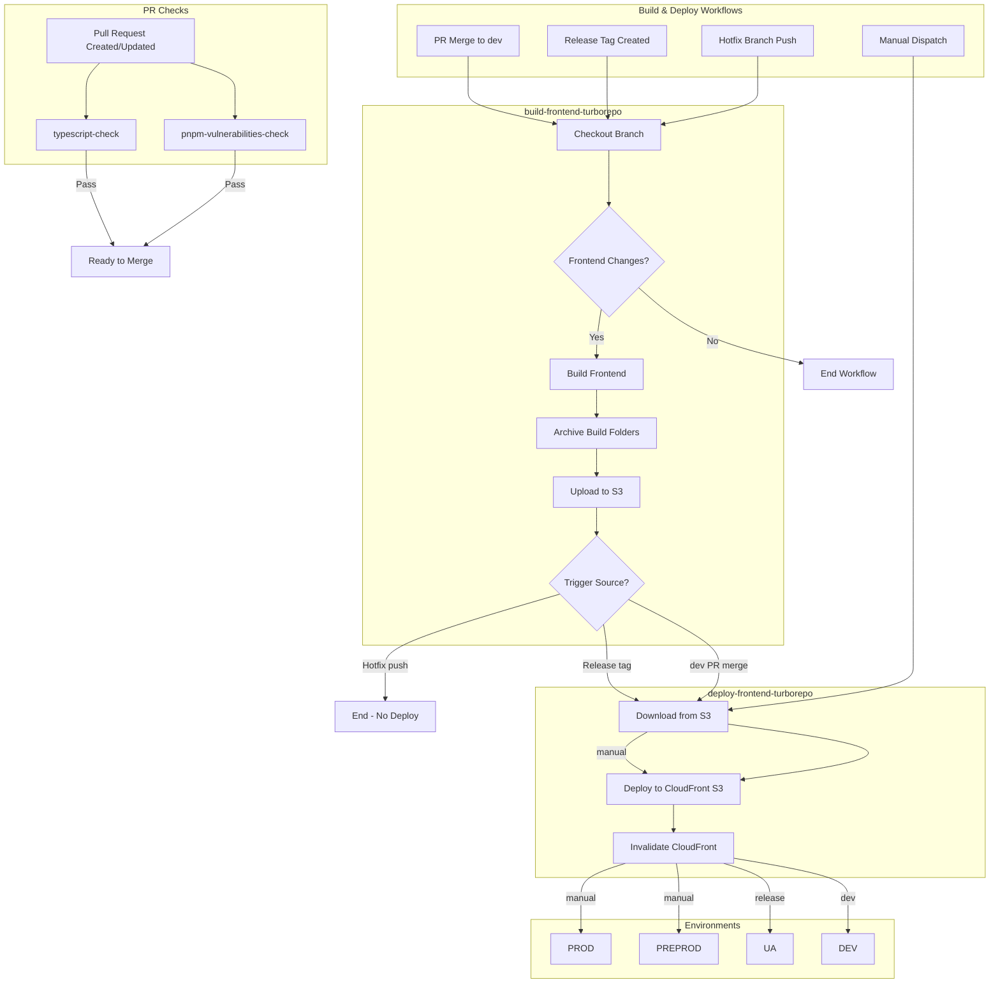
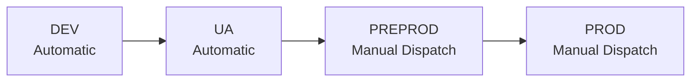
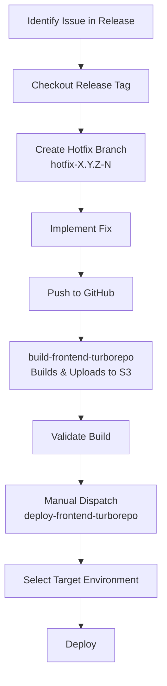

# Git and Deployment Strategy

## Table of Contents

1. [Git Branch Organization](#1-git-branch-organization)
2. [Versioning Strategy](#2-versioning-strategy)
3. [GitHub Workflows](#3-github-workflows)
4. [Environment Upgrade Process](#4-environment-upgrade-process)

---

## 1. Git Branch Organization

### Branch Types

| Branch Type | Pattern | Purpose | Protection |
|-------------|---------|---------|------------|
| Development | `dev` | Main development branch | Protected, PR merge only |
| Hotfix | `hotfix-{MAJOR}.{MINOR}.{PATCH}-{BUILD}` | Emergency fixes for releases | Temporary, build-only |

> **Note:** Feature and bugfix branches are not used in this workflow.

### Release Tags

| Tag Type | Pattern | Purpose | Trigger |
|----------|---------|---------|---------|
| Release | `v{MAJOR}.{MINOR}.{PATCH}-{BUILD}` | Immutable version snapshots | Automatic deployment to UA |

### Branch Flow Diagram



### Branch Rules

#### `dev` Branch

- **Primary development branch** — all new code merges here
- **Protected branch** — direct pushes forbidden
- **Merge method** — Pull Request merge only
- On PR merge → triggers `build-frontend-turborepo` workflow → deploys to **DEV**

#### Release Tags (`v*`)

- Created from `dev` branch when ready for release
- **Naming:** `v{MAJOR}.{MINOR}.{PATCH}-{BUILD}`
- **Immutable** — tags are permanent and cannot be modified
- On tag creation → triggers `build-frontend-turborepo` workflow → deploys to **UA**

#### Hotfix Branches (`hotfix-*`)

- Created from the target release tag
- **Naming:** `hotfix-{MAJOR}.{MINOR}.{PATCH}-{NEW_BUILD}`
- Only the `{BUILD}` number increments
- On push → triggers `build-frontend-turborepo` workflow (build only, no deployment)
- Deployment requires manual dispatch of `deploy-frontend-turborepo` workflow

---

## 2. Versioning Strategy

### Semantic Versioning

Format: `{MAJOR}.{MINOR}.{PATCH}-{BUILD}`

| Component | Description | When to Increment |
|-----------|-------------|-------------------|
| MAJOR | Breaking changes | Incompatible API changes |
| MINOR | New features | Backward-compatible functionality |
| PATCH | Bug fixes | Backward-compatible bug fixes |
| BUILD | Hotfix iteration | Hotfix applied to a release |

### Version Source

Version is **extracted from the branch or tag name** during build:

| Source | Extracted Version |
|--------|-------------------|
| `dev` (PR merge) | `dev` |
| `v1.2.0-0` (tag) | `1.2.0-0` |
| `hotfix-1.2.0-1` (branch) | `1.2.0-1` |

### Versioning Rules

1. **New releases** from `dev` always start with `BUILD = 0`
2. **Hotfixes** only increment the `BUILD` number
3. MAJOR, MINOR, PATCH remain unchanged during hotfix
4. After hotfix, next release from `dev` resets `BUILD` to 0
5. Hotfix does not create a new release tag

### Examples

| Scenario | Version |
|----------|---------|
| Initial release | `1.0.0-0` |
| First hotfix on 1.0.0 | `1.0.0-1` |
| Second hotfix on 1.0.0 | `1.0.0-2` |
| New minor release | `1.1.0-0` |
| Hotfix on 1.1.0 | `1.1.0-1` |

---

## 3. GitHub Workflows

### Workflow Overview



---

### PR Check Workflows

These workflows run on every push to a Pull Request when frontend code changes are detected.

#### Workflow: `pnpm-vulnerabilities-check`

**Trigger:** Push to Pull Request (when frontend code changes detected)

**Purpose:** Scans dependencies for known security vulnerabilities.

**Steps:**

1. Checkout current branch
2. Run `pnpm audit`
3. Report vulnerabilities found
4. **Fail check** if high severity vulnerabilities are detected

**Behavior:**

| Severity | Action |
|----------|--------|
| None | ✓ Pass |
| Low / Moderate | ⚠️ Pass with warning |
| High / Critical | ✗ Fail |

---

#### Workflow: `typescript-check`

**Trigger:** Push to Pull Request (when frontend code changes detected)

**Purpose:** Validates TypeScript code for type errors and lint violations.

**Steps:**

1. Checkout current branch
2. Run TypeScript compiler/linter
3. Report any linter or compile errors
4. **Fail check** if errors are found

**Behavior:**

| Result | Action |
|--------|--------|
| No errors | ✓ Pass |
| Errors found | ✗ Fail (with error report) |

---

### Build & Deploy Workflows

#### Workflow: `build-frontend-turborepo`

**Triggers:**

- PR merge into `dev` branch
- Release tag creation (`v*`)
- Hotfix branch push (`hotfix-*`)

**Steps:**

1. Checkout current branch or tag
2. Check for changes in frontend code
3. If no changes → exit workflow
4. If changes exist:
   - Build frontend code (produces multiple build folders)
   - Archive each build folder
   - Upload archives to AWS S3 (path depends on trigger source)
5. Conditional deployment trigger

**S3 Upload Paths:**

| Trigger Source | S3 Path | Example |
|----------------|---------|---------|
| PR merge to `dev` | `/frontend/dev/{app_name}.zip` | `/frontend/dev/auth.zip` |
| Release tag creation | `/frontend/{VERSION}/{app_name}.zip` | `/frontend/1.1.2-0/auth.zip` |
| Hotfix branch push | `/frontend/{VERSION}/{app_name}.zip` | `/frontend/1.1.2-1/auth.zip` |

**Deployment Trigger:**

| Trigger Source | Action |
|----------------|--------|
| PR merge to `dev` | Trigger `deploy-frontend-turborepo` with `version=dev`, `instance=dev` |
| Release tag creation | Trigger `deploy-frontend-turborepo` with `version={extracted}`, `instance=ua` |
| Hotfix branch push | **No deployment** (build only) |

---

#### Workflow: `deploy-frontend-turborepo`

**Triggers:**

- Called by `build-frontend-turborepo` workflow (automatic)
- Manual dispatch (for Preprod/Prod or hotfix deployments)

**Inputs:**

| Parameter | Type | Description |
|-----------|------|-------------|
| `version` | string | Version identifier: `dev` or semver (e.g., `1.1.2-0`) |
| `instance` | string | Target environment: `dev`, `ua`, `preprod`, or `prod` |

**Steps:**

1. Download frontend archives from S3:

   ```text
   /frontend/{version}/*.zip
   ```

2. Deploy to target instance's CloudFront origin S3 bucket
3. Invalidate CloudFront distribution

---

### Workflow Trigger Summary

#### PR Check Workflow Triggers

| Event | Workflow | Condition |
|-------|----------|-----------|
| Push to PR | `pnpm-vulnerabilities-check` | Frontend code changed |
| Push to PR | `typescript-check` | Frontend code changed |

#### Build & Deploy Workflow Triggers

| Event | Workflow | Build | Deploy |
|-------|----------|-------|--------|
| PR merge to `dev` | `build-frontend-turborepo` → `deploy-frontend-turborepo` | ✓ | ✓ (DEV) |
| Release tag created | `build-frontend-turborepo` → `deploy-frontend-turborepo` | ✓ | ✓ (UA) |
| Hotfix branch push | `build-frontend-turborepo` | ✓ | ✗ |
| Manual dispatch | `deploy-frontend-turborepo` | — | ✓ (PREPROD/PROD/Hotfix) |

---

## 4. Environment Upgrade Process

### Environment Progression



### Environment Details

| Environment | Trigger | Deployment Method | Purpose |
|-------------|---------|-------------------|---------|
| DEV | PR merge to `dev` | Automatic | Development testing |
| UA | Release tag creation | Automatic | User acceptance testing |
| PREPROD | Manual dispatch | Manual | Pre-production validation |
| PROD | Manual dispatch | Manual | Production release |

### Deployment Rules

1. **DEV** — Deployed automatically on every PR merge to `dev`
2. **UA** — Deployed automatically when release tag is created
3. **PREPROD** — Requires manual dispatch of `deploy-frontend-turborepo` with version selection
4. **PROD** — Requires manual dispatch of `deploy-frontend-turborepo` with version selection

> **Note:** No formal approval workflow is implemented. Deployments to PREPROD and PROD require manual dispatch only.

### Hotfix Deployment Process



**Hotfix Steps:**

1. Checkout target release tag (e.g., `v1.1.2-0`)
2. Create hotfix branch with incremented BUILD: `hotfix-1.1.2-1`
3. Implement fixes and commit
4. Push to GitHub → triggers `build-frontend-turborepo` (build only)
5. Validate the build
6. Manually dispatch `deploy-frontend-turborepo` to deploy to required environment

**Important:** After hotfix, the next release from `dev` resets BUILD to 0. No new release tag is created for hotfixes.

---

## Quick Reference

### Creating a New Release

```bash
# Ensure dev is up to date
git checkout dev
git pull origin dev

# Create release tag
git tag v1.2.0-0
git push origin v1.2.0-0
# → Automatically builds and deploys to UA
```

### Creating a Hotfix

```bash
# Checkout the release tag that needs fixing
git checkout v1.2.0-0

# Create hotfix branch (increment BUILD number)
git checkout -b hotfix-1.2.0-1

# Make fixes, commit, push
git add .
git commit -m "fix: critical bug fix"
git push origin hotfix-1.2.0-1
# → Triggers build-only workflow (no deployment)

# After validation, manually deploy via GitHub Actions
# Run: deploy-frontend-turborepo
# Inputs: version=1.2.0-1, instance=prod
```

### Manual Deployment to Preprod/Prod

1. Go to GitHub Actions
2. Select `deploy-frontend-turborepo` workflow
3. Click "Run workflow"
4. Enter:
   - `version`: e.g., `1.2.0-0`
   - `instance`: `preprod` or `prod`
5. Click "Run workflow"

---

## Appendix

### Branch Protection Settings

#### `dev` Branch Protection

```text
✓ Require pull request before merging
✓ Require approvals (recommended: 1+)
✓ Dismiss stale PR approvals
✓ Require status checks to pass
  └─ pnpm-vulnerabilities-check
  └─ typescript-check
✗ Allow force pushes
✗ Allow deletions
```

#### `v*` Tags

```text
✓ Tags are immutable by default in Git
✓ Cannot be modified or deleted once pushed
✓ Use annotated tags for releases (recommended)
```

#### `hotfix-*` Branches

```text
✗ No special protection (temporary branches)
```
